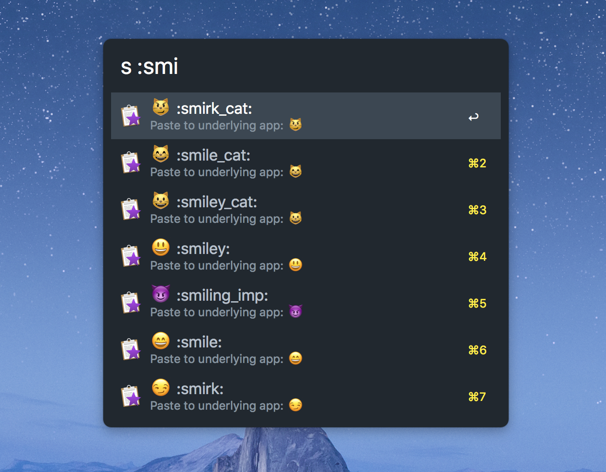

# Alfred Emoji Pack

> Based and inspired by the awesome [Emoji Snippet Pack](http://joelcalifa.com/blog/alfred-emoji-snippet-pack/) by [Joel Califa](http://joelcalifa.com)


**Deprecated: The build process has been added to [Joel's repository](https://github.com/califa/alfred-emoji-pack). Future releases will be added in that repo.**




⚠️ Doesn't support Unicode 10 or 11 yet. See [#2](https://github.com/stefanzweifel/alfred-emoji-pack/issues/2) for more information.

## Installation

1. Download the lastest release of [Emoji Pack.alfredsnippets](https://github.com/stefanzweifel/alfred-emoji-pack/raw/master/Emoji%20Pack.alfredsnippets)
2. Double-click the file and import the snippets into Alfred
3. Enable "Auto Expand" on your favourite Emojis
4. 💸💸💸

## New Build

```
yarn install
yarn build
```

## Based on 

- [gemoji (Ruby Gem)](https://github.com/github/gemoji)
- [gemoji (Node Package)](https://github.com/wooorm/gemoji)

## License

MIT
